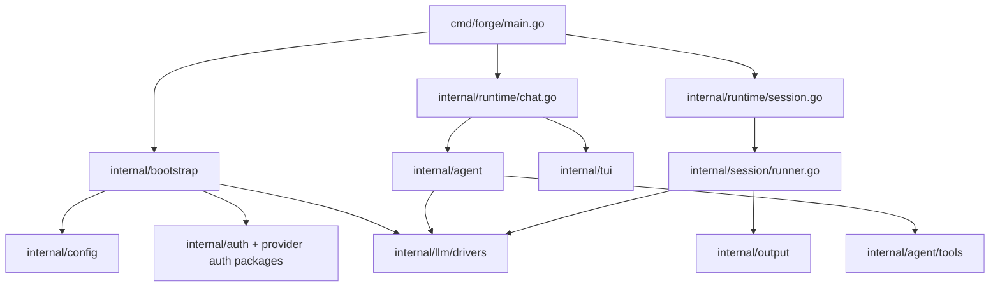
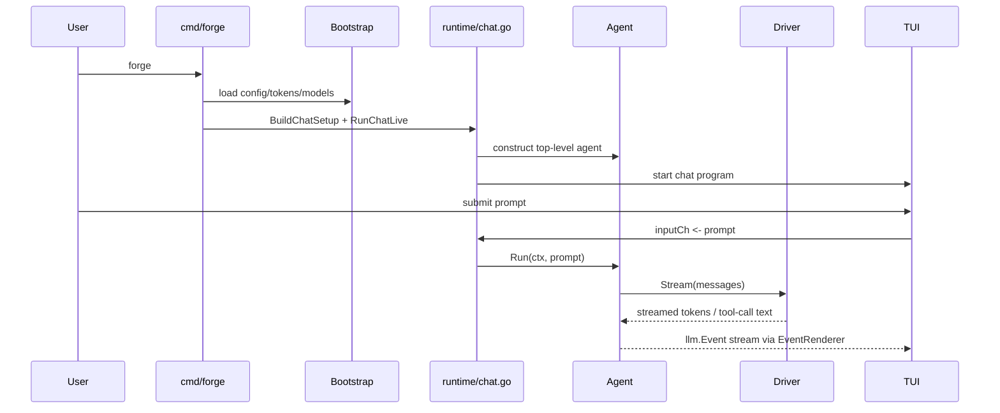
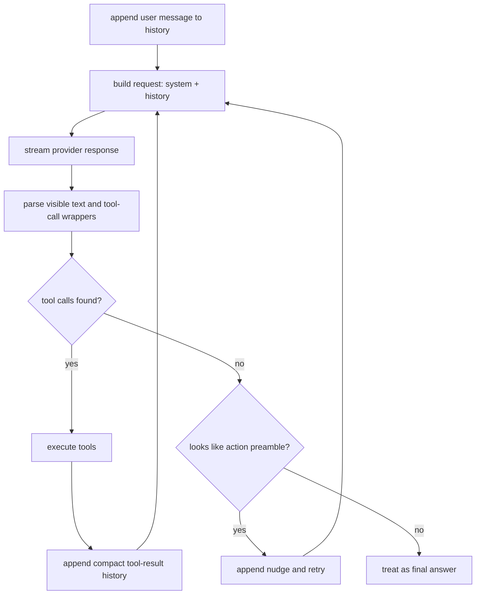
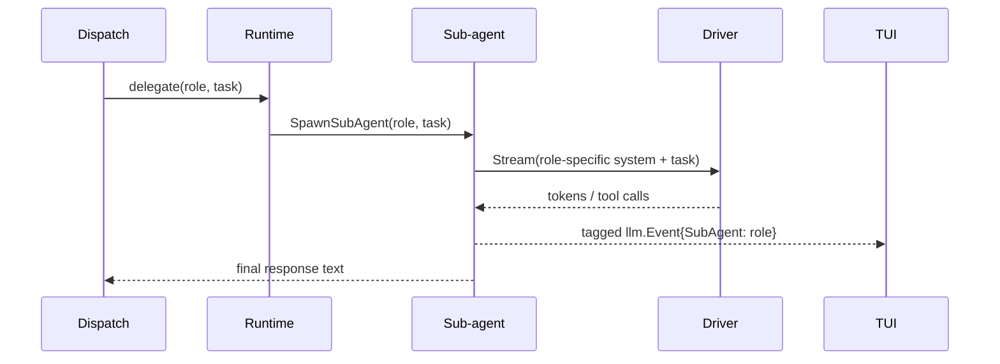
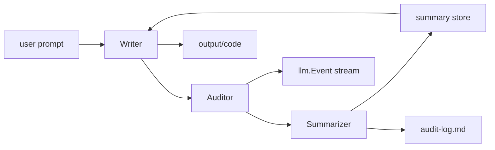

# Forge Architecture

This document explains how Forge works today at the code level: entrypoints, runtime composition, model/provider routing, the agent loop, multi-agent delegation, the TUI event flow, and the pass-based session runner.

## System Overview



## Top-Level Shape

Forge has two distinct execution models:

1. Chat mode
   - interactive
   - acts directly on the current working tree
   - centered around a single `agent.Agent` with optional delegated sub-agents
2. Improvement pipeline
   - batch-oriented
   - runs a sequence of writer/auditor/summarizer passes
   - writes artifacts into a timestamped output directory

The main CLI entrypoint is [cmd/forge/main.go](/Users/cass/git/forge/cmd/forge/main.go).

Important command families:

- `forge`
- `forge make`
- `forge improve` (compatibility alias for batch pipeline runs)
- `forge list`
- `forge show`
- `forge perf`
- `forge auth copilot`
- `forge status`

## Package Map

The core package boundaries are:

- [cmd/forge/main.go](/Users/cass/git/forge/cmd/forge/main.go)
  - CLI entrypoint and command dispatch
- [internal/bootstrap/runtime.go](/Users/cass/git/forge/internal/bootstrap/runtime.go)
  - config/auth loading, provider/model discovery, driver construction
- [internal/runtime/chat.go](/Users/cass/git/forge/internal/runtime/chat.go)
  - chat-mode assembly and event loop wiring
- [internal/agent/agent.go](/Users/cass/git/forge/internal/agent/agent.go)
  - main agent loop, tool-call parsing, tool execution, history management
- [internal/agent/subagent.go](/Users/cass/git/forge/internal/agent/subagent.go)
  - delegated sub-agent execution
- [internal/agent/roles.go](/Users/cass/git/forge/internal/agent/roles.go)
  - multi-agent role definitions and tool restrictions
- [internal/agent/tools/](/Users/cass/git/forge/internal/agent/tools)
  - tool implementations and tool registry
- [internal/tui/](/Users/cass/git/forge/internal/tui)
  - startup UI, chat UI, post-run screens, overlays, message rendering
- [internal/session/runner.go](/Users/cass/git/forge/internal/session/runner.go)
  - pass-based pipeline orchestration
- [internal/llm/](/Users/cass/git/forge/internal/llm)
  - driver interface, event types, retry wrapper, usage tracking
- [internal/llm/drivers/](/Users/cass/git/forge/internal/llm/drivers)
  - provider-specific driver implementations
- [internal/config/config.go](/Users/cass/git/forge/internal/config/config.go)
  - TOML config model and key resolution
- [internal/auth/store.go](/Users/cass/git/forge/internal/auth/store.go)
  - Forge-owned token storage

## CLI Flow

The CLI starts in [cmd/forge/main.go](/Users/cass/git/forge/cmd/forge/main.go).

There are two important top-level flows:

- default chat flow via `forge`
  - builds a chat session and launches the live chat runtime
- legacy writer/auditor flow via `forge make`
  - starts the older writer/auditor pipeline UI or batch pipeline entrypoint depending on arguments

Even though the repository still contains multiple UI layers, the current chat runtime path is:

1. `runChat(...)`
2. `runtime.BuildChatSetup(...)`
3. `runtime.RunChatLive(setup)`
4. `tui.RunChatLive(...)`
5. `tui.RunChatLiveBubbleTea(...)`
6. `ChatModel`

That last point matters: the current live chat surface is the Bubble Tea model in [internal/tui/chatmodel.go](/Users/cass/git/forge/internal/tui/chatmodel.go).

### Chat call path



## Configuration And State

Forge configuration lives in [internal/config/config.go](/Users/cass/git/forge/internal/config/config.go).

Default config path:

- `$XDG_CONFIG_HOME/forge/config.toml`
- otherwise `~/.config/forge/config.toml`

Path construction is centralized in [internal/fsutil/home.go](/Users/cass/git/forge/internal/fsutil/home.go).

Config contains:

- model defaults for writer, auditor, summarizer
- chat configuration
- retry configuration
- git behavior
- provider API keys
- multi-agent settings

Authentication and stored credentials live in Forge-owned JSON storage:

- `$XDG_CONFIG_HOME/forge/auth.json`
- otherwise `~/.config/forge/auth.json`

The token schema is defined in [internal/auth/store.go](/Users/cass/git/forge/internal/auth/store.go).

Forge now owns ChatGPT and Claude subscription auth state directly. It does not depend on Codex-auth files as a source of truth.

Custom API-key providers also use Forge-owned auth storage. Their credentials are stored in the dynamic `provider_api_keys` map inside `auth.json`, keyed by provider id.

### Config precedence

In practice, Forge resolves configuration from multiple layers:

1. environment variables
2. `config.toml`
3. Forge auth storage for provider credentials
4. built-in defaults

That precedence is especially relevant for provider keys and default model selection.

### Custom provider config files

File-backed OpenAI-compatible providers are loaded by [internal/bootstrap/custom_providers.go](/Users/cass/git/forge/internal/bootstrap/custom_providers.go).

The loader scans:

- `~/.config/forge/providers/*.toml`
- `~/.config/forge/*.toml` for files containing `[model_providers.<id>]`

The accepted v1 shape is:

```toml
[model_providers.oca]
name = "My New Provider"
base_url = "https://example.com/v1"
wire_api = "responses"
http_headers = { client = "codex-cli" }
default_model = "gpt-5.4"
models = ["gpt-5.4", "gpt-5.4-mini"]
```

The loader intentionally ignores unrelated top-level Codex-style keys such as `model`, `profile`, `sandbox_mode`, and `[profiles.*]`. This lets Forge reuse the provider block without needing to understand the rest of the file.

## Model And Provider Resolution

Provider and model routing live in [internal/bootstrap/runtime.go](/Users/cass/git/forge/internal/bootstrap/runtime.go).

The key responsibilities there are:

- loading config and tokens
- constructing the model registry
- turning model names into concrete `llm.Driver` implementations
- computing provider status for the UI
- discovering available models

### Driver selection

`DriverForModel(...)` is the central switchboard.

It resolves, in priority order:

- `claude` subscription-backed models
- `anthropic` API-key-backed models
- `chatgpt` subscription-backed models
- `copilot` when unqualified OpenAI-family models are routed there
- `openai`
- `copilot`
- configured OpenAI-compatible providers
- file-backed custom OpenAI-compatible providers

This file is one of the highest-leverage points in the codebase. If model routing feels wrong in the UI, the bug is often here rather than in the TUI itself.

### Qualified vs unqualified model names

Forge supports both:

- qualified names such as `openai/gpt-5.4` or `claude/claude-sonnet-4-6`
- unqualified names such as `gpt-5.4` or `claude-sonnet-4-6`

For unqualified names, Forge resolves to the most appropriate available provider. The UI uses `ModelDisplayLabel(...)` to surface the effective auth path in the picker.

### Custom provider bootstrap path

`BuildCompatProviders(...)` appends file-backed providers after the built-in compat-provider catalog.

Each loaded provider definition becomes a `CompatProvider` carrying:

- provider id
- display label
- base URL
- model list
- optional request headers
- optional `wire_api` preference
- a key lookup that checks Forge auth first, then `<PROVIDER_ID>_API_KEY`

This design keeps custom providers on the existing compat-provider path instead of introducing a second routing stack.

### Live model discovery

Model availability comes from a mix of curated lists and live discovery.

Current notable cases:

- Claude subscription and Anthropic API use live Anthropic `/v1/models` discovery through [internal/bootstrap/anthropic_models.go](/Users/cass/git/forge/internal/bootstrap/anthropic_models.go)
- OpenAI-compatible providers can optionally use live compat model discovery when `FORGE_ENABLE_LIVE_COMPAT_MODELS=1`
- the default compat-provider behavior is curated catalogs, not live enumeration

For Claude subscription logins, Forge normalizes the discovered feed down to the latest visible family models such as:

- `claude-opus-4-6`
- `claude-sonnet-4-6`
- `claude-haiku-4-5`

That normalization exists because provider feeds may expose multiple snapshots or dated variants, while the chat picker should present one clear entry per current family model.

## LLM Driver Layer

The core LLM abstractions live in [internal/llm/types.go](/Users/cass/git/forge/internal/llm/types.go).

Important interfaces:

- `Driver`
- `Configurable`
- `UsageReporter`
- `ConversationResetter`
- `RequestModeReporter`

Every provider-specific driver implements `Driver.Stream(ctx, messages, out)`.

### Retry wrapper

[internal/llm/retry.go](/Users/cass/git/forge/internal/llm/retry.go) wraps concrete drivers with:

- bounded retries
- exponential backoff with jitter
- timeout scoping per attempt
- shared 10-second cooldown after rate-limit responses

The retry wrapper is used in both chat and pipeline flows.

### ChatGPT/OpenAI family

The OpenAI-family drivers live in [internal/llm/drivers/openai.go](/Users/cass/git/forge/internal/llm/drivers/openai.go).

Notable behavior:

- ChatGPT subscription-backed GPT-5/Codex-family requests are routed through a ChatGPT/Codex-compatible responses path
- model display labels show whether the chosen auth path is `chatgpt`, `openai`, or another provider
- file-backed custom providers can attach provider-specific headers and opt into the Responses API with `wire_api = "responses"`
- custom providers stay generic: they do not inherit ChatGPT-only stateless responses behavior, response-store behavior, or response compaction

### Claude family

Claude has two distinct paths:

- [internal/llm/drivers/claude.go](/Users/cass/git/forge/internal/llm/drivers/claude.go)
  - Anthropic API-key-backed
  - uses beta messages with prompt caching
- [internal/llm/drivers/claude_oauth.go](/Users/cass/git/forge/internal/llm/drivers/claude_oauth.go)
  - Claude.ai subscription-backed
  - uses OAuth bearer auth
  - does not force prompt caching
  - adds the Claude CLI-flavored request markers used by this path

## Chat Runtime

Chat setup is assembled in [internal/runtime/chat.go](/Users/cass/git/forge/internal/runtime/chat.go).

`BuildChatSetup(...)`:

- normalizes the working directory
- loads tokens
- discovers available models
- computes provider status/options
- picks the starting chat model
- builds a `MakeDriver` closure that re-loads config/tokens on demand

`RunChatLive(...)` then wires together:

- the event channel
- the render target
- approval handling
- the tool registry
- skills
- chat state
- the top-level `agent.Agent`
- the TUI config

### Chat runtime responsibilities

`RunChatLive(...)` is the seam where several subsystems are glued together:

- model/provider state from bootstrap
- approval flow from the renderer
- live tool registry construction
- chat state and skills
- agent construction
- live callbacks used by the TUI for provider/model refresh and switching

The provider picker in [internal/tui/chatmodel.go](/Users/cass/git/forge/internal/tui/chatmodel.go) stays generic for these providers. Unknown non-interactive provider ids are treated as API-key providers, and their credentials flow through the dynamic token helpers in [internal/tui/chatshared.go](/Users/cass/git/forge/internal/tui/chatshared.go).

### Tool registration

`registerTools(...)` in [internal/runtime/chat.go](/Users/cass/git/forge/internal/runtime/chat.go) registers the chat toolset:

- `read_file`
- `write_file`
- `edit_file`
- `list_dir`
- `search`
- `run_command`
- `think`
- `glob`
- `git_status`
- `git_diff`
- `git_log`
- `git_commit`
- `web_fetch`
- `web_search`
- `tool_help`

Some tools are prompt-hidden and are only exposed through `tool_help`.

This is one of the mechanisms Forge uses to reduce prompt bloat without giving up capability.

## Agent Loop

The main execution engine is [internal/agent/agent.go](/Users/cass/git/forge/internal/agent/agent.go).

At a high level, `Agent.Run(...)` does this:

1. append the user message to local history
2. rebuild the request with:
   - system prompt
   - accumulated local history
3. stream the provider response
4. filter visible text from tool-call wrappers
5. parse tool calls from the full raw response
6. if there are tool calls:
   - execute them
   - append compact tool-result history
   - continue to the next turn
7. if there are no tool calls:
   - treat the response as final
   - stop unless it is an actual action preamble

### Agent turn lifecycle



### Tool-call format

The system prompt built by [internal/agent/system.go](/Users/cass/git/forge/internal/agent/system.go) instructs the model to emit tool invocations in a strict wrapper:

```text
<tool_call>
{"name": "tool_name", "args": {"param": "value"}}
</tool_call>
```

Forge parses those wrappers out of the streamed response and executes the named tool locally.

### History management

Forge keeps a local message history and periodically compacts it using the token-budget logic in [internal/agent/agent.go](/Users/cass/git/forge/internal/agent/agent.go).

Important properties:

- old assistant/tool content is compressed to short summaries when needed
- hidden-tool disclosure is handled by the tool registry
- stateful provider-side conversation state can be reset if the driver supports it

The important architectural tradeoff here is that Forge keeps enough history to preserve context, but is willing to compress older turns aggressively to stay within model budgets.

### Preamble retry behavior

Forge used to retry any short no-tool answer, which caused accidental loops for legitimate short replies. That logic is now narrower: retries only happen for detected “action preamble” responses, not for ordinary short final answers.

## Multi-Agent Delegation

Multi-agent mode is configured in [internal/runtime/chat.go](/Users/cass/git/forge/internal/runtime/chat.go) and defined in [internal/agent/roles.go](/Users/cass/git/forge/internal/agent/roles.go).

Current roles:

- `dispatch`
- `scout`
- `builder`
- `doctor`
- `architect`

Each role has:

- a role-specific system prompt
- an allowed tool subset
- a max-turn budget

### How delegation works

When enabled:

1. the top-level agent is reconfigured as `dispatch`
2. dispatch gets only orchestration tools such as `delegate`, `think`, and scratchpad tools
3. sub-agents are spawned through [internal/agent/subagent.go](/Users/cass/git/forge/internal/agent/subagent.go)
4. the selected role gets:
   - a filtered tool registry
   - a role prompt appended to the base system prompt
   - its own model if configured
5. sub-agent events are tagged and routed back through the shared renderer

### Delegation flow



### Event handling for sub-agents

[internal/agent/event_render.go](/Users/cass/git/forge/internal/agent/event_render.go) has both:

- `EventRenderer` for the top-level agent
- `SubAgentRenderer` for delegated agents

Sub-agent events include the `SubAgent` field on `llm.Event`, which the TUI uses to:

- keep the detailed tool audit trail in the tools pane
- surface compact “recent activity” blocks in the main chat pane
- keep completion summaries visible without flooding the transcript

## TUI Architecture

The active chat UI entrypoint is [internal/tui/chatshared.go](/Users/cass/git/forge/internal/tui/chatshared.go), which currently routes chat into [internal/tui/chatlive_bubbletea.go](/Users/cass/git/forge/internal/tui/chatlive_bubbletea.go) and the Bubble Tea `ChatModel`.

Important chat UI files:

- [internal/tui/chatmodel.go](/Users/cass/git/forge/internal/tui/chatmodel.go)
- [internal/tui/chatshared.go](/Users/cass/git/forge/internal/tui/chatshared.go)
- [internal/tui/chatlive_bubbletea.go](/Users/cass/git/forge/internal/tui/chatlive_bubbletea.go)
- [internal/tui/chatmsg.go](/Users/cass/git/forge/internal/tui/chatmsg.go)
- [internal/tui/errors.go](/Users/cass/git/forge/internal/tui/errors.go)

Current responsibilities include:

- rendering chat and tools panes
- session save/restore
- provider picker
- model picker
- agent model picker
- approvals
- stats and status lines
- recent activity blocks for sub-agents
- concise error distillation for provider errors

### TUI data model

The TUI is not just a renderer. It also owns interactive state for:

- model/provider overlays
- agent role model selection
- approvals
- saved chat sessions
- per-turn stats and request-mode displays
- recent-activity summarization for sub-agents

### Model picker behavior

The model picker:

- uses provider-resolved display labels
- supports typing to filter
- dedupes equivalent visible labels so users do not see both qualified and unqualified copies of the same effective choice
- no longer steals leading digits as quick-select when the user is filtering

## Pass-Based Improvement Pipeline

The non-chat session runner starts in [internal/runtime/session.go](/Users/cass/git/forge/internal/runtime/session.go) and delegates orchestration to [internal/session/runner.go](/Users/cass/git/forge/internal/session/runner.go).

The runner:

1. creates an output directory writer
2. ensures writer, auditor, and summarizer drivers exist
3. wraps them in retry drivers
4. runs configured passes in order
5. runs each pass for the requested number of rounds
6. emits `llm.Event` progress to the UI
7. writes summary and audit artifacts
8. optionally initializes and commits a Git repository in the generated code output

### Pipeline flow



The default conceptual passes are:

- correctness
- refactor
- security
- prod-ready

Those can be replaced with explicit pipeline configuration in `config.toml`.

## Auth Flows

Forge currently supports three classes of auth:

1. API keys
   - stored in config, environment, or Forge auth storage
2. device / browser login
   - Copilot
3. subscription OAuth-like bearer flows
   - ChatGPT
   - Claude.ai

Relevant packages:

- [internal/chatgptauth/auth.go](/Users/cass/git/forge/internal/chatgptauth/auth.go)
- [internal/claudeauth/auth.go](/Users/cass/git/forge/internal/claudeauth/auth.go)
- [internal/auth/store.go](/Users/cass/git/forge/internal/auth/store.go)

Key property: Forge-owned auth storage is the source of truth for these providers.

## Output, Logging, And Auditability

Pipeline mode persists artifacts under the configured output directory.

Chat mode operates in-place but still tracks:

- usage snapshots
- session stats
- provider diagnostics
- model/request mode hints

The event model in [internal/llm/types.go](/Users/cass/git/forge/internal/llm/types.go) is the shared transport between runtime and UI.

## Known Tensions

There are a few architectural seams worth knowing about:

- the repository still contains multiple UI layers and older docs that describe previous frontend choices
- chat mode and pipeline mode share drivers and some config, but their orchestration models are intentionally different
- provider routing is centralized, which is convenient, but it means model/provider/auth changes often touch one high-leverage file: [internal/bootstrap/runtime.go](/Users/cass/git/forge/internal/bootstrap/runtime.go)

If you change runtime behavior, re-check:

- provider resolution
- model picker labels
- chat request mode reporting
- TUI error rendering
- agent retry behavior

## Reading Order For New Contributors

If you are new to the codebase, the fastest useful reading order is:

1. [cmd/forge/main.go](/Users/cass/git/forge/cmd/forge/main.go)
2. [internal/bootstrap/runtime.go](/Users/cass/git/forge/internal/bootstrap/runtime.go)
3. [internal/runtime/chat.go](/Users/cass/git/forge/internal/runtime/chat.go)
4. [internal/agent/agent.go](/Users/cass/git/forge/internal/agent/agent.go)
5. [internal/tui/chatmodel.go](/Users/cass/git/forge/internal/tui/chatmodel.go)
6. [internal/session/runner.go](/Users/cass/git/forge/internal/session/runner.go)

That path gives you the current control flow before you dive into provider-specific or UI-specific details.
