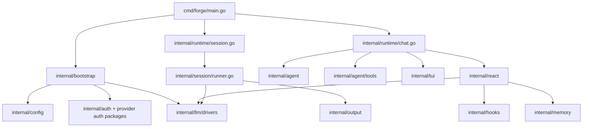
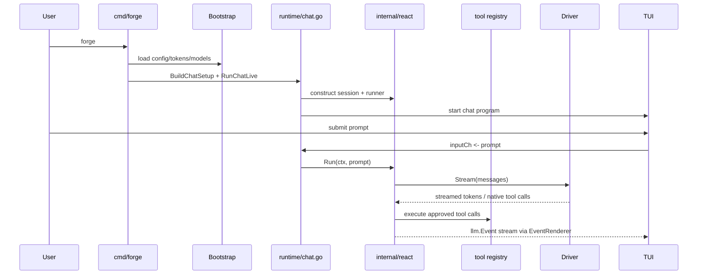

# Forge Architecture

This document explains how Forge works today at the code level: entrypoints, runtime composition, model/provider routing, the host-owned chat runtime, the TUI event flow, and the legacy pass-based session runner.

## System Overview



## Top-Level Shape

Forge has two distinct execution models:

1. Chat mode
   - interactive
   - acts directly on the current working tree
   - centered around a host-owned React runner, one visible `forge` assistant, typed runtime hooks, approvals, and optional bounded hidden workers
2. Improvement pipeline
   - batch-oriented
   - runs a sequence of writer/auditor/summarizer passes
   - writes artifacts into a timestamped output directory

The main CLI entrypoint is [cmd/forge/main.go](./cmd/forge/main.go).

Important command families:

- `forge`
- `forge make`
- `forge improve` (compatibility alias for batch pipeline runs)
- `forge list`
- `forge show`
- `forge perf`
- `forge auth copilot`
- `forge status`

## Package Map

The core package boundaries are:

- [cmd/forge/main.go](./cmd/forge/main.go)
  - CLI entrypoint and command dispatch
- [internal/bootstrap/runtime.go](./internal/bootstrap/runtime.go)
  - config/auth loading, provider/model discovery, driver construction
- [internal/runtime/chat.go](./internal/runtime/chat.go)
  - chat-mode assembly, approvals, tool registration, runtime wiring, and live/console entrypoints
- [internal/react/loop.go](./internal/react/loop.go)
  - host-owned turn runner, workflow state, completion checks, tool execution loop, and delegation hooks
- [internal/react/turn_contract.go](./internal/react/turn_contract.go)
  - per-turn runtime contract model, derivation, evidence records, gates, and durable protocol conversion
- [internal/react/side_effect_intent.go](./internal/react/side_effect_intent.go)
  - side-effect action derivation and gates for writes, verification, commits, and pushes
- [internal/react/session.go](./internal/react/session.go)
  - session snapshot/state model for history, task state, plan state, hook output, pending input, interruption, and memory summary
- [internal/react/prompt.go](./internal/react/prompt.go)
  - prompt assembly from system prompt, overlays, task/plan state, memory summary, and compacted history
- [internal/hooks/](./internal/hooks)
  - typed runtime hook registry, dispatch, overlay/note/block normalization
- [internal/memory/](./internal/memory)
  - bounded retained-context extraction, redaction, consolidation, and prompt-summary generation
- [internal/agent/agent.go](./internal/agent/agent.go)
  - shared prompting, rendering, and lower-level agent helpers still used by runtime surfaces
- [internal/agent/subagent.go](./internal/agent/subagent.go)
  - legacy delegated sub-agent execution retained for compatibility paths
- [internal/agent/roles.go](./internal/agent/roles.go)
  - legacy visible-role definitions and tool restrictions used only by compatibility paths
- [internal/agent/tools/](./internal/agent/tools)
  - tool implementations, preview/runtime helpers, git tools, web tools, and exec-session management
- [internal/tui/](./internal/tui)
  - startup UI, chat UI, post-run screens, overlays, message rendering
- [internal/session/runner.go](./internal/session/runner.go)
  - legacy pass-based pipeline orchestration
- [internal/llm/](./internal/llm)
  - driver interface, event types, retry wrapper, usage tracking
- [internal/llm/drivers/](./internal/llm/drivers)
  - provider-specific driver implementations
- [internal/config/config.go](./internal/config/config.go)
  - TOML config model and key resolution
- [internal/auth/store.go](./internal/auth/store.go)
  - Forge-owned token storage

## CLI Flow

The CLI starts in [cmd/forge/main.go](./cmd/forge/main.go).

There are two important top-level flows:

- default chat flow via `forge`
  - builds a chat session and launches the host-owned live chat runtime
- legacy writer/auditor flow via `forge make`
  - starts the older writer/auditor pipeline UI or batch pipeline entrypoint depending on arguments

The current chat runtime path is:

1. `runChat(...)`
2. `runtime.BuildChatSetup(...)`
3. `runtime.RunChatLive(setup)`
4. create `react.Session`, approvals, tools, preview runtime, exec-session manager, memory pipeline, and `react.Runner`
5. `tui.RunChatLive(...)`
6. `tui.RunChatLiveBubbleTea(...)`
7. `ChatModel`

That last point matters: the current live chat surface is the Bubble Tea model in [internal/tui/chatmodel.go](./internal/tui/chatmodel.go).

### Chat call path



## Configuration And State

Forge reads config from:

- `~/.config/forge/config.toml`
- or `$XDG_CONFIG_HOME/forge/config.toml` when `XDG_CONFIG_HOME` is set

Auth/token storage lives in:

- `~/.config/forge/auth.json`
- or `$XDG_CONFIG_HOME/forge/auth.json`
- otherwise `~/.config/forge/auth.json`

The token schema is defined in [internal/auth/store.go](./internal/auth/store.go).

Forge now owns ChatGPT and Claude subscription auth state directly. It does not depend on Codex-auth files as a source of truth.

Custom API-key providers also use Forge-owned auth storage. Their credentials are stored in the dynamic `provider_api_keys` map inside `auth.json`, keyed by provider id.

### Config precedence

In practice, Forge resolves configuration from multiple layers:

1. environment variables
2. `config.toml`
3. Forge auth storage for provider credentials
4. built-in defaults

That precedence is especially relevant for provider keys and default model selection.

### Custom provider config files

File-backed OpenAI-compatible providers are loaded by [internal/bootstrap/custom_providers.go](./internal/bootstrap/custom_providers.go).

The loader scans:

- `~/.config/forge/providers/*.toml`
- `~/.config/forge/*.toml` for files containing `[model_providers.<id>]`

The accepted v1 shape is:

```toml
[model_providers.oca]
name = "My New Provider"
base_url = "https://example.com/v1"
wire_api = "responses"
http_headers = { client = "codex-cli" }
default_model = "gpt-5.4"
models = ["gpt-5.4", "gpt-5.4-mini"]
```

The loader intentionally ignores unrelated top-level Codex-style keys such as `model`, `profile`, `sandbox_mode`, and `[profiles.*]`. This lets Forge reuse the provider block without needing to understand the rest of the file.

## Model And Provider Resolution

Provider and model routing live in [internal/bootstrap/runtime.go](./internal/bootstrap/runtime.go).

The key responsibilities there are:

- loading config and tokens
- constructing the model registry
- turning model names into concrete `llm.Driver` implementations
- computing provider status for the UI
- discovering available models

### Driver selection

`DriverForModel(...)` is the central switchboard.

It resolves, in priority order:

- `claude` subscription-backed models
- `anthropic` API-key-backed models
- `chatgpt` subscription-backed models
- `copilot` when unqualified OpenAI-family models are routed there
- `openai`

## LLM Abstractions

The core LLM abstractions live in [internal/llm/types.go](./internal/llm/types.go).

[internal/llm/retry.go](./internal/llm/retry.go) wraps concrete drivers with:

- consistent retry behavior
- backoff
- request timeouts

The OpenAI-family drivers live in [internal/llm/drivers/openai.go](./internal/llm/drivers/openai.go).

- [internal/llm/drivers/openai_ws.go](./internal/llm/drivers/openai_ws.go)
- [internal/llm/drivers/claude.go](./internal/llm/drivers/claude.go)
- [internal/llm/drivers/claude_oauth.go](./internal/llm/drivers/claude_oauth.go)

### Responses API vs Chat Completions

The driver selects the API endpoint per request:

- **gpt-5.x reasoning models** (gpt-5, gpt-5.4, gpt-5.5): always use the Responses API
- **Other models**: prefer chat completions with native tools; fall back to Responses when supported
- Reasoning models run in stateless/ZDR mode (`store: false`) on the ChatGPT provider, with `reasoning.encrypted_content` included for encrypted reasoning retention across turns

### WebSocket Transport

[internal/llm/drivers/openai_ws.go](./internal/llm/drivers/openai_ws.go) implements a WebSocket transport for the Responses API on the ChatGPT provider. The driver:

- Opens a persistent `wss://` connection to `chatgpt.com/backend-api/codex/responses`
- Sends `response.create` events over the WebSocket
- On continuation: sends `previous_response_id` + only new input items (delta), not the full conversation history
- Falls back to HTTP SSE on connection/auth failure (per-session sticky fallback)
- Handles `previous_response_not_found` by retrying with full input
- Processes streaming events: `response.output_text.delta`, `response.output_item.done`, `response.completed`, and reasoning events

### Native Tool Calling

The driver implements the `NativeToolCaller` interface. Tools are sent as structured function definitions (`strict: true`) via the Responses API `tools` parameter or chat completions `tools` parameter. The model returns structured function calls — not text-based `<tool_call>` XML parsing. The `ResponseOutputItemDoneEvent` captures function calls from streaming responses, including in ZDR mode where the completed event has no output items.

## Chat Runtime

Chat setup is assembled in [internal/runtime/chat.go](./internal/runtime/chat.go).

The runtime owns:

- approval gating and guardian review
- tool registration
- preview runtime and MCP integration
- exec-session lifecycle reporting
- suggested-skill and guardian overlays
- bounded memory retention updates after each turn
- delegation tool registration for hidden worker-style follow-up tasks

The provider picker in [internal/tui/chatmodel.go](./internal/tui/chatmodel.go) stays generic for these providers. Unknown non-interactive provider ids are treated as API-key providers, and their credentials flow through the dynamic token helpers in [internal/tui/chatshared.go](./internal/tui/chatshared.go).

### Tool registration

`registerTools(...)` in [internal/runtime/chat.go](./internal/runtime/chat.go) registers the chat toolset:

- `read_file`
- `write_file`
- `edit_file`
- `apply_patch`
- `artifact_write`
- `artifact_read`
- `preview_server_ensure`
- `preview_server_status`
- `list_dir`
- `search`
- `code_search`
- `lsp_definition`
- `lsp_references`
- `lsp_hover`
- `lsp_document_symbols`
- `run_command`
- `exec_session_start`
- `exec_session_status`
- `exec_session_write`
- `exec_session_resize`
- `exec_session_stop`
- `command_status`
- `command_write_stdin`
- `think`
- `glob`
- `git_status`
- `git_diff`
- `git_log`
- `git_branch_state`
- `git_merge_status`
- `git_commit`
- `view_image`
- `web_fetch`
- `web_search`
- `tool_help`
- plan-mode tools such as `update_plan`, `enter_plan_mode`, and `exit_plan_mode`

Some tools are prompt-hidden and are only exposed through `tool_help`.

This is one of the mechanisms Forge uses to reduce prompt bloat without giving up capability.

## React Turn Loop

The main chat execution engine is [internal/react/loop.go](./internal/react/loop.go).

At a high level, `Runner.Run(...)` does this:

1. append the user message to local history
2. compact history when needed
3. build prompt messages from:
   - base system prompt
   - typed hook overlays
   - task/plan state
   - memory summary
   - prior history/tool results
4. stream the provider response
5. execute approved tool calls through the registered toolset
6. update workflow state such as validation/search/git/repeat guidance
7. run completion checks before accepting the final answer
8. record post-turn memory summary updates and prompt-visible runtime state

### Turn Contract Kernel

The Turn Contract Kernel is the runtime-owned completion contract for chat turns. It is implemented primarily in [internal/react/turn_contract.go](./internal/react/turn_contract.go) and enforced from the turn loop in [internal/react/loop.go](./internal/react/loop.go). Prompt wording can guide the model, but it is not the enforcement boundary.

For each user turn, Forge derives a `TurnContract` from the request text and mirrors it with `SideEffectIntent` when the turn implies durable side effects. The contract records intent, required actions, required artifacts, verification requirements, evidence, gates, status, and source turn. It is converted into durable protocol state so replay keeps the runtime view of the turn, not just model prose.

Runtime evidence comes from executed tools and structured runtime events:

- read/search/git inspection tools record read evidence
- write/edit/patch/artifact tools record write evidence
- validation commands can record verification evidence when their results pass
- delegation tools record delegation evidence or delegation-failure evidence
- unknown tools, raw tool markup, and inconsistent plan state record model-violation evidence

Assistant text by itself is not completion evidence for real work. A final answer can report results only after the runtime accepts the relevant evidence and gates. Artifact gates fail closed for required artifacts: they require same-turn successful write evidence, an allowed exact path, workspace containment, file existence, and plausible content. Commit and push requests are mirrored through `SideEffectIntent` gates, and unresolved side-effect gates block finalization when the assistant claims side-effect success. Plan state is also a gate: an unresolved active plan step blocks successful finalization unless the assistant reports the blocker or failure instead of claiming success.

Final validation is centralized before assistant text is appended or a turn is completed as successful. The current hard gates focus on raw tool-call markup, missing required tool calls, required artifacts, side-effect success claims, delegation failures, and inconsistent plan state. Verification requirements and evidence are represented in the contract, but they are not currently a general final-completion gate. When a contract is not satisfied, Forge may append runtime feedback and retry, ask for clarification, or fail visibly with a concrete error. It must not convert missing evidence, missing artifacts, failed child work, or provider/tool failures into a successful completion.

## System Prompt and History

The base system prompt is built by [internal/agent/system.go](./internal/agent/system.go), but the full per-turn prompt assembly happens in [internal/react/prompt.go](./internal/react/prompt.go).

Prompt assembly layers in:

- compacted conversation summaries
- bounded memory summaries from [internal/memory/](./internal/memory)
- typed runtime hook overlays from [internal/hooks/](./internal/hooks)
- task state and plan state
- interruption guidance
- tool results and prior history

Forge keeps local message history in [internal/react/session.go](./internal/react/session.go) and compacts it through the React runtime’s session-budget logic.

## UI and Frontends

The active chat UI entrypoint is [internal/tui/chatshared.go](./internal/tui/chatshared.go), which currently routes chat into [internal/tui/chatlive_bubbletea.go](./internal/tui/chatlive_bubbletea.go) and the Bubble Tea `ChatModel`.

- [internal/tui/chatmodel.go](./internal/tui/chatmodel.go)
- [internal/tui/chatshared.go](./internal/tui/chatshared.go)
- [internal/tui/chatlive_bubbletea.go](./internal/tui/chatlive_bubbletea.go)
- [internal/tui/chatmsg.go](./internal/tui/chatmsg.go)
- [internal/tui/nudges.go](./internal/tui/nudges.go)
- [internal/tui/errors.go](./internal/tui/errors.go)

The active UI now surfaces:

- approvals
- quiet progress updates
- mode badges and nudges
- command-session lifecycle updates
- recent activity and runtime stats

## Session / Pipeline Runner

The non-chat session runner starts in [internal/runtime/session.go](./internal/runtime/session.go) and delegates orchestration to [internal/session/runner.go](./internal/session/runner.go).

This is the legacy `forge make` path. It remains supported, but it is not the main architectural direction of the repository.

## Auth Flows

Forge currently supports three classes of auth:

1. API keys
   - stored in config, environment, or Forge auth storage
2. device / browser login
   - Copilot
3. subscription OAuth-like bearer flows
   - ChatGPT
   - Claude.ai

Relevant packages:

- [internal/chatgptauth/auth.go](./internal/chatgptauth/auth.go)
- [internal/claudeauth/auth.go](./internal/claudeauth/auth.go)
- [internal/auth/store.go](./internal/auth/store.go)

Key property: Forge-owned auth storage is the source of truth for these providers.

## Output, Logging, And Auditability

Pipeline mode persists artifacts under the configured output directory.

Chat mode operates in-place but still tracks:

- usage snapshots
- session stats
- provider diagnostics
- model/request mode hints
- bounded retained memory summaries
- typed runtime guidance overlays
- command-session state changes

The event model in [internal/llm/types.go](./internal/llm/types.go) is the shared transport between runtime and UI.

## Known Tensions

There are a few architectural seams worth knowing about:

- the repository still contains a legacy pipeline surface (`forge make`) alongside the primary chat/runtime path
- chat mode and pipeline mode share drivers and some config, but their orchestration models are intentionally different
- prompt-visible behavior is increasingly host-owned via `internal/react`, `internal/hooks`, and `internal/memory`, but some older compatibility surfaces still exist
- provider routing is centralized, which is convenient, but it means model/provider/auth changes often touch one high-leverage file: [internal/bootstrap/runtime.go](./internal/bootstrap/runtime.go)

If you change runtime behavior, re-check:

- provider resolution
- model picker labels
- chat request mode reporting
- TUI error rendering
- completion checks, hook overlays, and memory-summary prompt assembly

## Reading Order For New Contributors

If you are new to the codebase, the fastest useful reading order is:

1. [cmd/forge/main.go](./cmd/forge/main.go)
2. [internal/bootstrap/runtime.go](./internal/bootstrap/runtime.go)
3. [internal/runtime/chat.go](./internal/runtime/chat.go)
4. [internal/react/loop.go](./internal/react/loop.go)
5. [internal/react/session.go](./internal/react/session.go)
6. [internal/react/prompt.go](./internal/react/prompt.go)
7. [internal/tui/chatmodel.go](./internal/tui/chatmodel.go)
8. [internal/session/runner.go](./internal/session/runner.go)

That path gives you the current control flow before you dive into provider-specific or UI-specific details.
