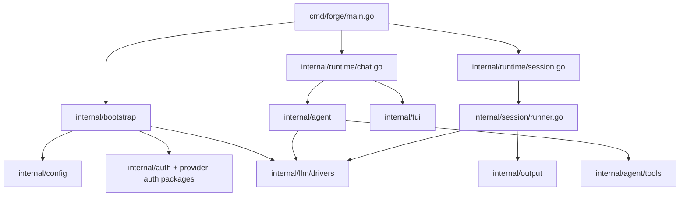
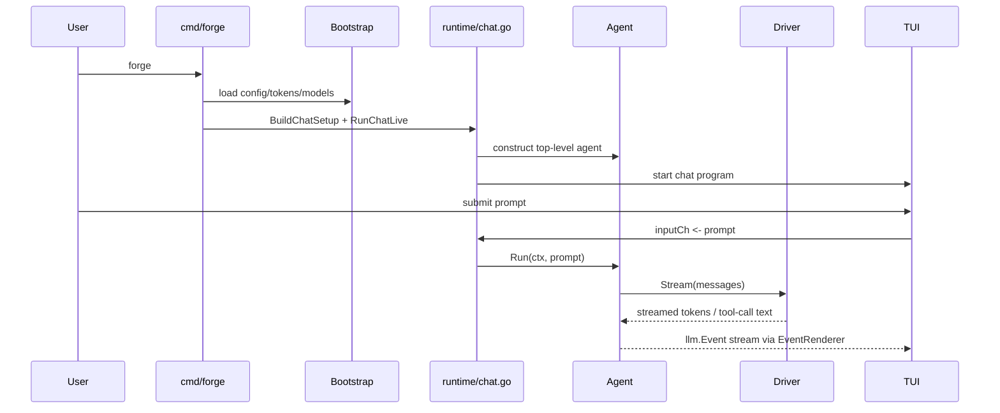

# Forge Architecture

This document explains how Forge works today at the code level: entrypoints, runtime composition, model/provider routing, the harness kernel, hidden-worker execution, the TUI event flow, and the pass-based session runner.

## System Overview



## Top-Level Shape

Forge has two distinct execution models:

1. Chat mode
   - interactive
   - acts directly on the current working tree
   - centered around the harness kernel, one visible `forge` assistant, and optional hidden bounded workers
2. Improvement pipeline
   - batch-oriented
   - runs a sequence of writer/auditor/summarizer passes
   - writes artifacts into a timestamped output directory

The main CLI entrypoint is [cmd/forge/main.go](./cmd/forge/main.go).

Important command families:

- `forge`
- `forge make`
- `forge improve` (compatibility alias for batch pipeline runs)
- `forge list`
- `forge show`
- `forge perf`
- `forge auth copilot`
- `forge status`

## Package Map

The core package boundaries are:

- [cmd/forge/main.go](./cmd/forge/main.go)
  - CLI entrypoint and command dispatch
- [internal/bootstrap/runtime.go](./internal/bootstrap/runtime.go)
  - config/auth loading, provider/model discovery, driver construction
- [internal/runtime/chat.go](./internal/runtime/chat.go)
  - chat-mode assembly and event loop wiring
- [internal/harness/](./internal/harness)
  - request classification, session carry-forward, planner/policy logic, strict-local routing, worker orchestration, and trace recording
- [internal/agent/agent.go](./internal/agent/agent.go)
  - underlying tool-using execution loop used by local, strict-local, and worker executors
- [internal/agent/subagent.go](./internal/agent/subagent.go)
  - legacy delegated sub-agent execution retained for compatibility paths
- [internal/agent/roles.go](./internal/agent/roles.go)
  - legacy visible-role definitions and tool restrictions used only by compatibility paths
- [internal/agent/tools/](./internal/agent/tools)
  - tool implementations and tool registry
- [internal/tui/](./internal/tui)
  - startup UI, chat UI, post-run screens, overlays, message rendering
- [internal/session/runner.go](./internal/session/runner.go)
  - pass-based pipeline orchestration
- [internal/llm/](./internal/llm)
  - driver interface, event types, retry wrapper, usage tracking
- [internal/llm/drivers/](./internal/llm/drivers)
  - provider-specific driver implementations
- [internal/config/config.go](./internal/config/config.go)
  - TOML config model and key resolution
- [internal/auth/store.go](./internal/auth/store.go)
  - Forge-owned token storage

## CLI Flow

The CLI starts in [cmd/forge/main.go](./cmd/forge/main.go).

There are two important top-level flows:

- default chat flow via `forge`
  - builds a chat session and launches the live chat runtime
- legacy writer/auditor flow via `forge make`
  - starts the older writer/auditor pipeline UI or batch pipeline entrypoint depending on arguments

Even though the repository still contains multiple UI layers, the current chat runtime path is:

1. `runChat(...)`
2. `runtime.BuildChatSetup(...)`
3. `runtime.RunChatLive(setup)`
4. `tui.RunChatLive(...)`
5. `tui.RunChatLiveBubbleTea(...)`
6. `ChatModel`

That last point matters: the current live chat surface is the Bubble Tea model in [internal/tui/chatmodel.go](./internal/tui/chatmodel.go).

### Chat call path



## Configuration And State

Forge reads config from:

- `~/.config/forge/config.toml`
- or `$XDG_CONFIG_HOME/forge/config.toml` when `XDG_CONFIG_HOME` is set

Auth/token storage lives in:

- `~/.config/forge/auth.json`
- or `$XDG_CONFIG_HOME/forge/auth.json`
- otherwise `~/.config/forge/auth.json`

The token schema is defined in [internal/auth/store.go](./internal/auth/store.go).

Forge now owns ChatGPT and Claude subscription auth state directly. It does not depend on Codex-auth files as a source of truth.

Custom API-key providers also use Forge-owned auth storage. Their credentials are stored in the dynamic `provider_api_keys` map inside `auth.json`, keyed by provider id.

### Config precedence

In practice, Forge resolves configuration from multiple layers:

1. environment variables
2. `config.toml`
3. Forge auth storage for provider credentials
4. built-in defaults

That precedence is especially relevant for provider keys and default model selection.

### Custom provider config files

File-backed OpenAI-compatible providers are loaded by [internal/bootstrap/custom_providers.go](./internal/bootstrap/custom_providers.go).

The loader scans:

- `~/.config/forge/providers/*.toml`
- `~/.config/forge/*.toml` for files containing `[model_providers.<id>]`

The accepted v1 shape is:

```toml
[model_providers.oca]
name = "My New Provider"
base_url = "https://example.com/v1"
wire_api = "responses"
http_headers = { client = "codex-cli" }
default_model = "gpt-5.4"
models = ["gpt-5.4", "gpt-5.4-mini"]
```

The loader intentionally ignores unrelated top-level Codex-style keys such as `model`, `profile`, `sandbox_mode`, and `[profiles.*]`. This lets Forge reuse the provider block without needing to understand the rest of the file.

## Model And Provider Resolution

Provider and model routing live in [internal/bootstrap/runtime.go](./internal/bootstrap/runtime.go).

The key responsibilities there are:

- loading config and tokens
- constructing the model registry
- turning model names into concrete `llm.Driver` implementations
- computing provider status for the UI
- discovering available models

### Driver selection

`DriverForModel(...)` is the central switchboard.

It resolves, in priority order:

- `claude` subscription-backed models
- `anthropic` API-key-backed models
- `chatgpt` subscription-backed models
- `copilot` when unqualified OpenAI-family models are routed there
- `openai`

## LLM Abstractions

The core LLM abstractions live in [internal/llm/types.go](./internal/llm/types.go).

[internal/llm/retry.go](./internal/llm/retry.go) wraps concrete drivers with:

- consistent retry behavior
- backoff
- request timeouts

The OpenAI-family drivers live in [internal/llm/drivers/openai.go](./internal/llm/drivers/openai.go).

- [internal/llm/drivers/claude.go](./internal/llm/drivers/claude.go)
- [internal/llm/drivers/claude_oauth.go](./internal/llm/drivers/claude_oauth.go)

## Chat Runtime

Chat setup is assembled in [internal/runtime/chat.go](./internal/runtime/chat.go).

The provider picker in [internal/tui/chatmodel.go](./internal/tui/chatmodel.go) stays generic for these providers. Unknown non-interactive provider ids are treated as API-key providers, and their credentials flow through the dynamic token helpers in [internal/tui/chatshared.go](./internal/tui/chatshared.go).

### Tool registration

`registerTools(...)` in [internal/runtime/chat.go](./internal/runtime/chat.go) registers the chat toolset:

- `read_file`
- `write_file`
- `edit_file`
- `list_dir`
- `search`
- `run_command`
- `think`
- `glob`
- `git_status`
- `git_diff`
- `git_log`
- `git_commit`
- `web_fetch`
- `web_search`
- `tool_help`

Some tools are prompt-hidden and are only exposed through `tool_help`.

This is one of the mechanisms Forge uses to reduce prompt bloat without giving up capability.

## Agent Loop

The main execution engine is [internal/agent/agent.go](./internal/agent/agent.go).

At a high level, `Agent.Run(...)` does this:

1. append the user message to local history
2. rebuild the request with:
   - system prompt
   - accumulated local history
3. stream the provider response
4. filter visible text from tool-call wrappers
5. parse tool calls from the full raw response
6. if there are tool calls:
   - execute them
   - append compact tool-result history
   - continue to the next turn
7. if there are no tool calls:
   - treat the response as final
   - stop unless it is an actual action preamble

## System Prompt and History

The system prompt built by [internal/agent/system.go](./internal/agent/system.go) instructs the model to emit tool invocations in a strict wrapper:

- tool calls are serialized into a JSON-like wrapper
- the model must not reveal hidden tool internals

Forge keeps a local message history and periodically compacts it using the token-budget logic in [internal/agent/agent.go](./internal/agent/agent.go).

Chat mode now defaults to a kernel-owned control plane in [internal/runtime/chat.go](./internal/runtime/chat.go) and [internal/harness/](./internal/harness).

## UI and Frontends

The active chat UI entrypoint is [internal/tui/chatshared.go](./internal/tui/chatshared.go), which currently routes chat into [internal/tui/chatlive_bubbletea.go](./internal/tui/chatlive_bubbletea.go) and the Bubble Tea `ChatModel`.

- [internal/tui/chatmodel.go](./internal/tui/chatmodel.go)
- [internal/tui/chatshared.go](./internal/tui/chatshared.go)
- [internal/tui/chatlive_bubbletea.go](./internal/tui/chatlive_bubbletea.go)
- [internal/tui/chatmsg.go](./internal/tui/chatmsg.go)
- [internal/tui/errors.go](./internal/tui/errors.go)

## Session / Pipeline Runner

The non-chat session runner starts in [internal/runtime/session.go](./internal/runtime/session.go) and delegates orchestration to [internal/session/runner.go](./internal/session/runner.go).

## Auth Flows

Forge currently supports three classes of auth:

1. API keys
   - stored in config, environment, or Forge auth storage
2. device / browser login
   - Copilot
3. subscription OAuth-like bearer flows
   - ChatGPT
   - Claude.ai

Relevant packages:

- [internal/chatgptauth/auth.go](./internal/chatgptauth/auth.go)
- [internal/claudeauth/auth.go](./internal/claudeauth/auth.go)
- [internal/auth/store.go](./internal/auth/store.go)

Key property: Forge-owned auth storage is the source of truth for these providers.

## Output, Logging, And Auditability

Pipeline mode persists artifacts under the configured output directory.

Chat mode operates in-place but still tracks:

- usage snapshots
- session stats
- provider diagnostics
- model/request mode hints

The event model in [internal/llm/types.go](./internal/llm/types.go) is the shared transport between runtime and UI.

## Known Tensions

There are a few architectural seams worth knowing about:

- the repository still contains multiple UI layers and older docs that describe previous frontend choices
- chat mode and pipeline mode share drivers and some config, but their orchestration models are intentionally different
- provider routing is centralized, which is convenient, but it means model/provider/auth changes often touch one high-leverage file: [internal/bootstrap/runtime.go](./internal/bootstrap/runtime.go)

If you change runtime behavior, re-check:

- provider resolution
- model picker labels
- chat request mode reporting
- TUI error rendering
- agent retry behavior

## Reading Order For New Contributors

If you are new to the codebase, the fastest useful reading order is:

1. [cmd/forge/main.go](./cmd/forge/main.go)
2. [internal/bootstrap/runtime.go](./internal/bootstrap/runtime.go)
3. [internal/runtime/chat.go](./internal/runtime/chat.go)
4. [internal/agent/agent.go](./internal/agent/agent.go)
5. [internal/tui/chatmodel.go](./internal/tui/chatmodel.go)
6. [internal/session/runner.go](./internal/session/runner.go)

That path gives you the current control flow before you dive into provider-specific or UI-specific details.
