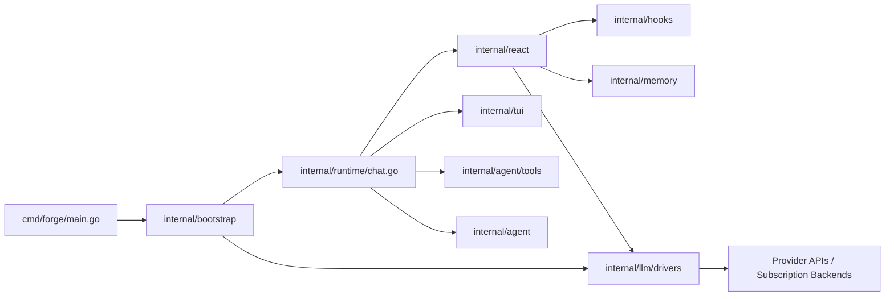

# Forge

Forge is a terminal-first coding agent for local repositories.

It has one primary mode and one legacy compatibility mode:

- `forge`: the primary interactive coding loop with a host-owned runtime, typed runtime hooks, provider switching, approvals, preview workflows, exec sessions, and bounded hidden worker delegation when the runtime decides it helps
- `forge make`: a legacy writer/auditor pipeline retained for batch-style passes and compatibility workflows

Forge is designed to run against your local working tree, use multiple model providers, and keep the user in control of destructive actions.

## What Forge Does

Forge is optimized for local software work:

- inspect and edit files in the current repository
- run commands, tests, and git queries
- switch models and providers without leaving the chat session
- keep one coherent transcript while the runtime can optionally use hidden reader/editor/verifier/researcher workers behind the scenes
- run a separate legacy writer/auditor pipeline for iterative or prompt-driven code generation

Forge is not a hosted SaaS or remote coding sandbox. It is a native local tool that acts on the repository you launch it in.

## Highlights

- local coding agent with file, search, git, command, and web tools
- provider-aware model routing across ChatGPT, Claude.ai, OpenAI, Anthropic, Copilot, and OpenAI-compatible backends
- host-owned React runtime with task/mode state, typed hook overlays, bounded memory summaries, and completion enforcement
- live chat TUI with model picker, provider picker, approvals, nudges, recent activity, quiet progress updates, and runtime stats
- command exec sessions for long-running terminal work without blocking the visible chat loop
- legacy pass-based improvement pipeline for correctness, refactor, security, and production-readiness work
- session artifacts, summaries, audit logs, and usage tracking

## Quick Start

Prerequisite: install `just` and make sure it is available on your `PATH`. If you need setup details, see [BUILD.md](./BUILD.md).

Build locally:

```bash
just build
```

Run chat in the current repository:

```bash
just run
```

Run the legacy writer/auditor pipeline:

```bash
./bin/forge make
```

## Typical Chat Flow

Start in the repository you want Forge to work on:

```bash
./bin/forge -C /path/to/repo
```

Inside chat you can:

- type a normal request, such as `fix the failing test in auth.go`
- switch models with the model picker
- switch providers or log in through the provider picker
- use `/trace` under `forge -d` when you need the advanced runtime trace

Common examples:

```text
explain how auth is wired in this repo
fix the failing Claude model picker test
search for where model routing chooses chatgpt vs openai
```

`just build` runs the underlying `go build -o ./bin/forge ./cmd/forge` command if you want the lower-level equivalent.

## Configuration

Forge reads config from:

- `~/.config/forge/config.toml`
- or `$XDG_CONFIG_HOME/forge/config.toml` when `XDG_CONFIG_HOME` is set

Auth/token storage lives in:

- `~/.config/forge/auth.json`
- or `$XDG_CONFIG_HOME/forge/auth.json`

Environment variables override file-based keys where supported.

Minimal example:

```toml
[models]
writer     = "claude-sonnet-4-6"
auditor    = "gpt-4o"
summarizer = "claude-haiku-4-5"

[chat]
model = "claude/claude-sonnet-4-6"
last_model = "claude/claude-sonnet-4-6"
```

Permissions can be scoped by source. Precedence is fixed from broadest to narrowest: managed, user, project, local, session, then CLI. For example:

```toml
[[permissions.project.rules]]
behavior = "deny"
tool = "run_command"
pattern = "rm:*"

[[permissions.user.rules]]
behavior = "allow"
tool = "run_command"
pattern = "go test:*"
```

Secret handling policies are configured separately:

```toml
[security.secrets]
read = "redact"
write = "block"
command_output = "redact"
approval_detail = "redact"
```

Automatic permission classification is off by default and can be configured explicitly:

```toml
[permissions.auto]
enabled = false
posture = "balanced"
model = ""
max_consecutive_denials = 3
max_total_denials = 20
failure_behavior = "ask"
```

Chat model startup precedence is:

1. `--model`
2. `FORGE_CHAT_MODEL`
3. `chat.last_model`
4. `chat.model`

## Providers

Forge supports both API-key and subscription-backed providers.

Interactive login providers:

- `chatgpt`
- `claude`
- `copilot`

API-key providers:

- `openai`
- `anthropic`
- `groq`
- `mistral`
- `xai`
- `nvidia`
- `openrouter`
- `together`
- `perplexity`
- `deepinfra`
- `cerebras`

Provider intent:

- `claude` means Claude.ai subscription login
- `anthropic` means Anthropic API key
- `chatgpt` means ChatGPT subscription login
- `openai` means OpenAI API key

### Custom OpenAI-Compatible Providers

Forge can load additional OpenAI-compatible providers from config files without a code change.

Supported file locations:

- `~/.config/forge/providers/*.toml`
- `~/.config/forge/*.toml` when the file contains `[model_providers.<id>]`

Example:

```toml
[model_providers.oca]
name = "My New Provider"
base_url = "https://example.com/v1"
wire_api = "responses"
http_headers = { client = "codex-cli", client-version = "0" }
default_model = "gpt-5.4"
models = ["gpt-5.4", "gpt-5.4-mini"]
```

How Forge uses this:

- `oca` becomes the provider id and model prefix, for example `oca/gpt-5.4`
- `name` becomes the provider-picker label
- `base_url` points Forge at the provider's OpenAI-compatible endpoint
- `wire_api = "responses"` opts that provider into the Responses API path
- `http_headers` are attached to every request for that provider
- `default_model` and `models` drive the provider/model picker entries

Auth behavior:

- selecting the provider in the provider picker prompts for an API key
- Forge stores custom-provider API keys in its own `auth.json`
- you can also set an environment override using `<PROVIDER_ID>_API_KEY`, for example `OCA_API_KEY`

Current v1 limits:

- custom providers are OpenAI-compatible only
- picker entries appear only when the provider has `models = [...]` or `default_model`
- interactive OAuth/sign-in flows are not supported for custom providers

Model picker entries are labeled with the resolved auth path, for example:

- `gpt-5.4 [chatgpt]`
- `gpt-5.4 [openai]`
- `claude-sonnet-4-6 [claude]`
- `claude-sonnet-4-6 [anthropic]`

### GPT-5.x Reasoning Models

Forge treats `gpt-5`, `gpt-5.4`, and `gpt-5.5` as reasoning models. These models:

- Use the Responses API (not chat completions) for both text and tool calling
- Run in stateless Zero Data Retention mode (`store: false`) on the ChatGPT provider
- Get a WebSocket transport (`wss://`) on the ChatGPT provider, with automatic HTTP fallback
- Use `previous_response_id` chaining on WebSocket for delta-only message sends (avoiding full-history re-sends)
- Include encrypted reasoning content for context continuity across turns
- Do not support the `temperature` parameter

See [docs/chatgpt-provider.md](./docs/chatgpt-provider.md) for full provider details.

## Commands

Core commands:

```bash
forge [--model MODEL] [-C PATH]
forge make [<path>] [--prompt "..."]
forge improve <path> [--prompt "..."]
forge plugin validate <path>
forge plugin install <source>
forge list
forge show <session-id>
forge perf
forge perf show <session-id>
forge auth copilot
forge status
forge skills
```

Useful command families:

- `forge`: primary local interactive coding loop
- `forge make`: legacy writer/auditor/summarizer pipeline
- `forge perf`: session usage and throughput reporting
- `forge plugin install`: installs an npm package, git URL, local filesystem path, or HTTP(S) `.js`/`.mjs` URL; local manifest directories are supported
- `forge status`: auth and provider status snapshot

Useful chat slash commands:

```text
/compact
/compact recent 20
/compact status
```

## Output

Pipeline sessions write artifacts into `./output/<timestamp>/` by default, including:

- generated code under `code/`
- `summary-store.md`
- `audit-log.md`
- `session.log`

Chat mode is interactive and works directly against the current working tree.

## Architecture At A Glance



## Documentation

- [ARCHITECTURE.md](ARCHITECTURE.md): detailed internal architecture
- [BUILD.md](BUILD.md): local builds and cross-compilation
- [CONTRIBUTING.md](CONTRIBUTING.md): contributor workflow and repo conventions
- [LOCAL_TOOLING.md](LOCAL_TOOLING.md): local toolchain requirements for hooks
- [docs/multi-agent.md](docs/multi-agent.md): archived notes for the older visible multi-agent design

## Notes

- Forge does not currently produce one native binary that runs unchanged on every OS. Build one binary per target OS/architecture pair.
- `forge` currently uses the Bubble Tea chat frontend through [internal/tui/chatmodel.go](internal/tui/chatmodel.go).
- `forge make` remains supported, but it is legacy compatibility surface rather than the main architectural direction.
