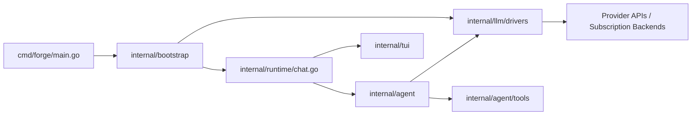

# Forge

Forge is a terminal-first coding agent for local repositories.

It has two primary modes:

- `forge chat`: an interactive coding loop with tool use, provider switching, approvals, and optional multi-agent delegation
- `forge` / `forge improve`: a pass-based improvement pipeline that iterates writer, auditor, and summarizer models over a codebase

Forge is designed to run against your local working tree, use multiple model providers, and keep the user in control of destructive actions.

## What Forge Does

Forge is optimized for local software work:

- inspect and edit files in the current repository
- run commands, tests, and git queries
- switch models and providers without leaving the chat session
- delegate work to specialist sub-agents when multi-agent mode is enabled
- run a separate batch improvement pipeline for iterative writer/auditor review

Forge is not a hosted SaaS or remote coding sandbox. It is a native local tool that acts on the repository you launch it in.

## Highlights

- local coding agent with file, search, git, command, and web tools
- provider-aware model routing across ChatGPT, Claude.ai, OpenAI, Anthropic, Copilot, and OpenAI-compatible backends
- optional multi-agent delegation with `dispatch`, `scout`, `builder`, `doctor`, and `architect` roles
- live chat TUI with model picker, provider picker, approvals, recent activity, and runtime stats
- pass-based improvement pipeline for correctness, refactor, security, and production-readiness work
- session artifacts, summaries, audit logs, and usage tracking

## Quick Start

Build locally:

```bash
go build -o ./bin/forge ./cmd/forge
```

Run chat in the current repository:

```bash
./bin/forge chat
```

Run the pass-based improvement pipeline:

```bash
./bin/forge improve
```

## Typical Chat Flow

Start in the repository you want Forge to work on:

```bash
cd /path/to/repo
./bin/forge chat
```

Inside chat you can:

- type a normal request, such as `fix the failing test in auth.go`
- switch models with the model picker
- switch providers or log in through the provider picker
- enable multi-agent mode so `dispatch` can delegate to `scout`, `builder`, `doctor`, and `architect`

Common examples:

```text
explain how auth is wired in this repo
fix the failing Claude model picker test
search for where model routing chooses chatgpt vs openai
```

## Configuration

Forge reads config from:

- `~/.config/forge/config.toml`
- or `$XDG_CONFIG_HOME/forge/config.toml` when `XDG_CONFIG_HOME` is set

Auth/token storage lives in:

- `~/.config/forge/auth.json`
- or `$XDG_CONFIG_HOME/forge/auth.json`

Environment variables override file-based keys where supported.

Minimal example:

```toml
[models]
writer     = "claude-sonnet-4-6"
auditor    = "gpt-4o"
summarizer = "claude-haiku-4-5"

[chat]
model = "claude/claude-sonnet-4-6"

[chat.agents]
enabled = true
```

## Providers

Forge supports both API-key and subscription-backed providers.

Interactive login providers:

- `chatgpt`
- `claude`
- `copilot`

API-key providers:

- `openai`
- `anthropic`
- `groq`
- `mistral`
- `xai`
- `nvidia`
- `openrouter`
- `together`
- `perplexity`
- `deepinfra`
- `cerebras`

Provider intent:

- `claude` means Claude.ai subscription login
- `anthropic` means Anthropic API key
- `chatgpt` means ChatGPT subscription login
- `openai` means OpenAI API key

Model picker entries are labeled with the resolved auth path, for example:

- `gpt-5.4 [chatgpt]`
- `gpt-5.4 [openai]`
- `claude-sonnet-4-6 [claude]`
- `claude-sonnet-4-6 [anthropic]`

## Commands

Core commands:

```bash
forge chat [--model MODEL] [--yolo] [-C PATH]
forge improve
forge list
forge show <session-id>
forge perf
forge perf show <session-id>
forge auth copilot
forge status
forge skills
```

Useful command families:

- `forge chat`: local interactive coding loop
- `forge improve`: batch writer/auditor/summarizer pipeline
- `forge perf`: session usage and throughput reporting
- `forge status`: auth and provider status snapshot

## Output

Pipeline sessions write artifacts into `./output/<timestamp>/` by default, including:

- generated code under `code/`
- `summary-store.md`
- `audit-log.md`
- `session.log`

Chat mode is interactive and works directly against the current working tree.

## Architecture At A Glance



## Documentation

- [docs/architecture.md](/Users/cass/git/forge/docs/architecture.md): detailed internal architecture
- [docs/build.md](/Users/cass/git/forge/docs/build.md): local builds and cross-compilation
- [docs/contributing.md](/Users/cass/git/forge/docs/contributing.md): contributor workflow and repo conventions
- [LOCAL_TOOLING.md](/Users/cass/git/forge/LOCAL_TOOLING.md): local toolchain requirements for hooks
- [docs/multi-agent.md](/Users/cass/git/forge/docs/multi-agent.md): older multi-agent design notes

## Notes

- Forge does not currently produce one native binary that runs unchanged on every OS. Build one binary per target OS/architecture pair.
- `forge chat` currently uses the Bubble Tea chat frontend through [internal/tui/chatmodel.go](/Users/cass/git/forge/internal/tui/chatmodel.go).
